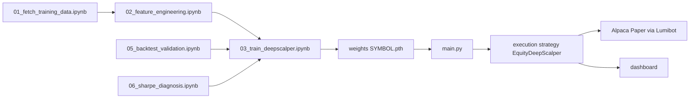

# How Training and Live Work (Current State)

This document describes the current architecture after the TradeMaster parity refactor.

## 1) End-to-End Flow

## 2) Live Runtime

- Entry point: main.py
- Strategy: execution/strategy.py, class EquityDeepScalper
- Broker: execution/broker.py (PAPER=True)
- State construction: execution/state_builder.py
- Network inference: colab/deepscalper/architecture.py, class DeepScalperNet

### Live policy semantics

- Direction actions:
  - 0 = SHORT
  - 1 = FLAT
  - 2 = LONG
- Session policy:
  - regular US market hours
  - open/close buffers and EOD flattening controlled by config.py

## 3) Training Runtime

- Environment: colab/deepscalper/environment.py (ScalperEnv)
- Agent: colab/deepscalper/agent.py (DeepScalperAgent)
- Network: colab/deepscalper/architecture.py (DeepScalperNet)

### TradeMaster-aligned training controls now active

- Uniform replay is default active path (ReplayBuffer)
- update_net cadence based on repeat_times and added samples
- Static explore_rate epsilon-greedy behavior
- clip_grad_norm, soft_update_tau, state_value_tau are wired
- Active loss path is Q-loss only

### Removed from active parity path

- Auxiliary volatility head/loss usage
- PER-specific weighting path in default training flow

## 4) Canonical Hyperparameter Block

The current canonical block in config.py follows TradeMaster values:

- EPOCHS = 20
- BATCH_SIZE = 64
- HORIZON_LEN = 128
- BUFFER_SIZE = 1_000_000
- LEARNING_RATE = 1e-3
- GAMMA = 0.9
- REPEAT_TIMES = 1.0
- CLIP_GRAD_NORM = 3.0
- SOFT_UPDATE_TAU = 0.0
- STATE_VALUE_TAU = 0.005
- EXPLORE_RATE = 0.25

Compatibility aliases are still present in config.py for legacy code paths.

## 5) Notebook 03 Wiring

03_train_deepscalper.ipynb is now wired to canonical keys and uses:

- DeepScalperAgent(... repeat_times, clip_grad_norm, soft_update_tau, state_value_tau, explore_rate ...)
- agent.update_net() for updates
- epochs / horizon_len / buffer_size keys

This keeps notebook training behavior aligned with the refactored agent core.

## 6) Weight Format and Loading

Checkpoint loading supports both wrappers:

- ckpt[online_net] state dict layout
- direct state dict layout

Live and backtest loaders both use:

- state_dict = ckpt.get("online_net", ckpt)

## 7) Validation Status

Current automated status after parity updates:

- Full test suite passes
- One intentionally skipped legacy test remains

## 8) Where To Change What

- Hyperparameters and runtime policy: config.py
- Agent training internals: colab/deepscalper/agent.py
- Model architecture and forward signature: colab/deepscalper/architecture.py
- Live order/inference behavior: execution/strategy.py
- Training orchestration: colab/03_train_deepscalper.ipynb
- Local backtest checks: backtest_validation_local.py
